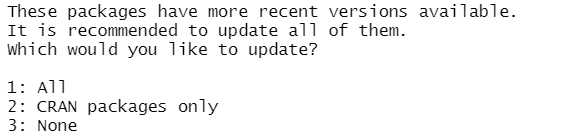

Roberto Lentini, 2021JULY09

# Proposal Similarity Checker (Shiny) App 

A shiny app for checking similarities between proposals.

Additional information, documentation, and guides coming soon.

<hr>

* Install [R](https://cran.r-project.org/) first and then [RStudio](https://rstudio.com/products/rstudio/download/). Please choose the correct installer carefully as it will depend on your computer's operating system.

<br>

* I am currently dealing with a working directory issue to produce similarity reports. To solve the issue for now, you will need to download the zip file for the project.


<br>

* Extract the folder by clicking the extract all button.


<br>

* Then open the project by clicking the ProposalSimilarityChecker.Rproj and running the next lines in opened the terminal within Rstudio.


<br> 

* Download and install the shiny app directly with the following lines of code:
```
  if (!require("devtools")){
    install.packages("devtools")
  }
  devtools::install_github(repo = "roblen001/document_similarity_checker")
```
If you get the following message in your RStudio console, please type 3.
<br><br>


<br>

* Type ```library("ProposalSimilarityChecker")``` to activate the package.

<br>

* Type ```ProposalSimilarityChecker::installPackages()``` to install any missing packages and/or dependencies. Please type 3 again if you get the message above.

<br>

* When installation is complete, type ```ProposalSimilarityChecker::runApp()``` to open the app.

<br>
